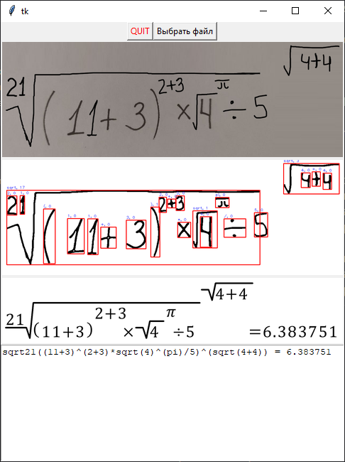
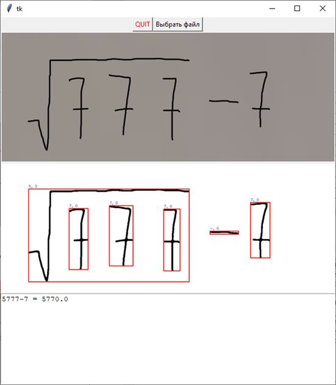

## Распознование образов
Проект студентов УГАТУ ФИРТ ПРО-416 [Григорьева Евгения](https://github.com/snodack), [Хабирова Владислава](https://github.com/Creckeryop), Попова Данила по дисциплине Распознование образов. 
### Краткое описание проекта
Программа проекта позволяет пользователю по фотографии математического выражения получить решение выражения 
## Поддерживаемые символы
`0, 1, 2, 3, 4, 5, 6, 7, 8, 9, +, -, *, ÷, (, ), sin, cos, tan, √, !, 𝜋` 
Также поддерживаются степени и степени корня

## Скриншоты программы

## Описание файлов и папок репозитории
Файл / папка | Предназначение
:----------|:--------------- 
Analize/ | Папка с тестовыми данными, которые можно проверить программой
letter/ | Папка с символами для отрисовки математических выражений
model3/ | Модель нейронной сети
screenshots/ | Скриншоты проекта
NN.py | Код для тренировки модели
formulapainter.py | Код для отрисовки формул
gui.py | Программа для запуска
main.py | Код распознования выражения с изображений
polska.py | Код польской нотации
## Способ запуска
Для начала нужно установить Python 3.8 и следующие библиотеки:
* PIL
* tenserflow
* cv2
* matplotlib

После установки всего этого следует ввести: 
`python gui.py`

## Компиляция в .exe файл
Для начала нужно установить Python 3.8 и следующие библиотеки:
* PIL
* tenserflow
* cv2
* pypiwin32
* pyinstaller

И введите следующее в cmd 
`pyinstaller --add-data "main.py;." --add-data "formulapainter.py;." --add-data "letter/*.png;letter" --add-data "model3;model3" -D --noconsole gui.py` 
После создания папки dist скопировать в неё папки: model3 и letter 
